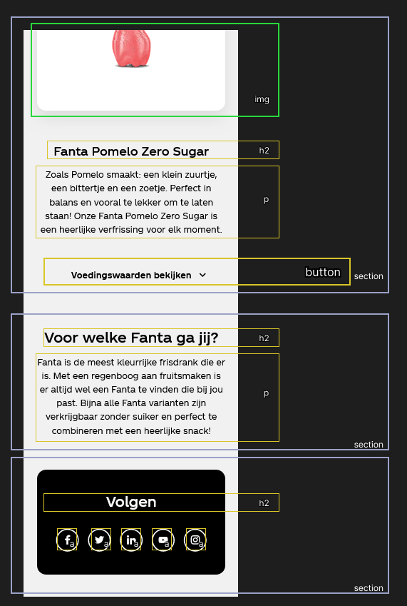
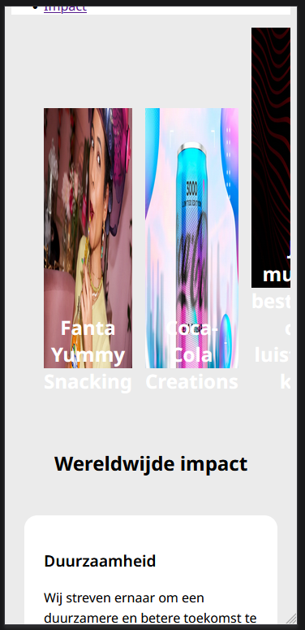
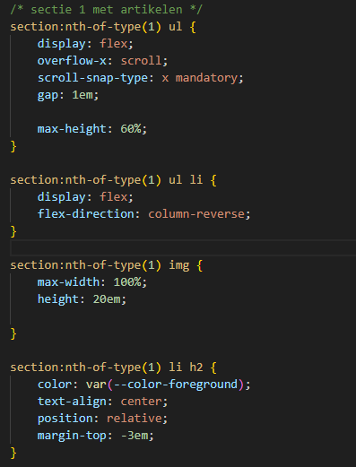
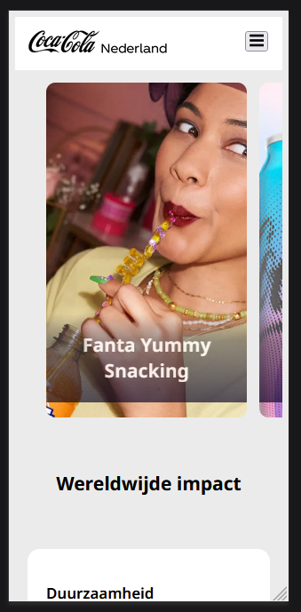
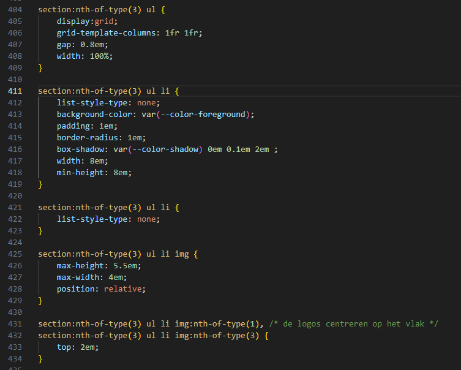
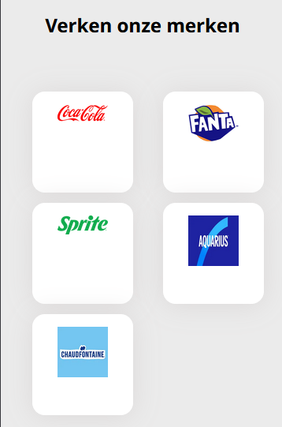

# Procesverslag

## Jij

  
uitwerken voor kick-off werkgroep

  ### Auteur:
  Sten Kotten

  #### Je startniveau:
  Blauwe piste

  #### Je focus:
  Surface
 

## Je website

  
uitwerken voor kick-off werkgroep

  ### Je opdracht:
  https://www.coca-cola.com/nl/nl

  #### Screenshot(s) van de eerste pagina (small screen): 
  hier de naam van de pagina  
  
 

  #### Screenshot(s) van de tweede pagina (small screen):
  hier de naam van de pagina  
  
 

## Toegankelijkheidstest 1/2 (week 1)

  
uitwerken na test in 2e werkgroep

  ### Bevindingen
  Lijst met je bevindingen die in de test naar voren kwamen:
  ## Screenreader
  Bij het gebruiken van de screenreader en het openen van de site wordt de tagline "De wereld verfrissen en het verschil maken, coca cola". 
  Als ik naar de volgende heading wil door op H te klikken, zegt de screenreader alleen "scannen". Na een poosje te wachten gebeurt er niks. Ook nog een keer op H klikken heeft geen effect.
  Wanneer ik op K klik om naar de volgende link te gaan, krijg ik een pop-up met de vraag of ik naar de content wil skippen. Door op enter te klikken wil ik de content skippen, echter vertelt de screenreader voor de tweede keer de tagline van de website. Door op K te klikken probeer ik verder door te website te komen, maar ik krijg nog steeds allen van de header/banner te horen.
  Bij het gaan naar de volgende link pakt hij een random slide van de caroussel, zoals 4 van de 5. De screenreader geeft ook niet echt een goede beschrijving van hoe de slide eruit ziet, alleen de tekst.
  Na met K twee keer door de hele caroussel te zijn gegaan, kom ik eindelijk bij de volgende sectie uit, en ik hoor "lees meer"... Je kan dus niet met de heading scanner de site navigeren, maar als je de link scanner gebruikt sla je een gedeelte van de content over. 
  De volgende links zijn 'Coca cola logo', 'Fanta logo' etc., echter heeft de gebruiker geen context over deze button, waar ga je naartoe en wat er te wachten staat is nog onduidelijk voor de gebruiker. Het volgende dat wordt gehoord is "Alle bekijken".
  In de footer, waar je je locatie kan selecteren, wordt gewoon de al geselecteerde locatie opgenoemd. Gebruiker wordt met veel vragen afgelaten.

  Ook op de merk pagina van Fanta kan ik H niet gebruiken om door de Headings te gaan. K Werkt wel om door de links te gaan. Content skippen kan wederom niet. De eerst volgende linkjes die te horen zijn na de banner zijn alle social links en daarna weer de footer.

  Conclusie: de website is niet te gebruiken met een screenreader, vooral omdat de heading scan niet bruikbaar is op de website, en alleen via de linkjes is er geen pap van te maken.

  ## WCAG Checklist
  De coca cola website kwam niet heel erg goed door de WCAG checklist. Er is zeker ruimte voor verbeteringen.
  Beschrijvingen van links waren een beetje onduidelijk. 
  Het veranderen van de windows text grootte doet niks.
  Qua contrast was het meeste goed, alleen de h2 tekst boven op de carousel afbeeldingen was niet goed genoeg. De focus state erover was ook onvoldoende.
  De html check gaf weer dat er verschillende soorten errors waren. Na een fatale error kon de checker niet verder met zoeken.

## Breakdownschets (week 1)

  
uitwerken na afloop 3e werkgroep

  ### de hele pagina: 
  

  ### dynamisch deel (bijv menu): 
  

   

## Voortgang 1 (week 2)

  
uitwerken voor 1e voortgang

  ### Stand van zaken
  html bijna volledig uitgewerkt. Alleen iconen van social media en dergeleke ontbreken nog. In de css alleen nog maar een paar kleurtjes en een fontje toegevoegd.

  ### Agenda voor meeting
  samen met je groepje opstellen

  | melvin         | edward             | jesse        | sten             |
  | ---            | ---                | ---          | ---              |
  | h1 in de header of main wanneer verborgen? | in en uit klappen nav bar             | wat wordt er verwacht van functionaliteiten als filters?    | html check    |
  | logo gebruiken als h1 | mag je hr's gebruiken? | nog een punt | hoe maak je een dropdown? |
  | html check en carousels goed? | ...                | ...          | ...              |

  ### Verslag van meeting
  hier na afloop snel de uitkomsten van de meeting vastleggen

  - script moet onderaan de body
  - dropdown kan worden gedaan met javascript
  - plek van de h1 in de html is goed
  - rest van de html ziet er ook prima uit

## Voortgang 2 (week 3)

  
uitwerken voor 2e voortgang

  ### Stand van zaken
  hier dit ging goed & dit was lastig (neem ook screenshots op van delen van je website en code)
Ik ben ongeveer anderhalve week ziek geweest :( ik vond het moeilijk om op de juiste manier de imgs te croppen en scalen.
  
ik probeer het door een max width en height te geven aan de img, alleen ziet het er nog lelijk uit.

  ### Agenda voor meeting
  samen met je groepje opstellen

  | melvin         | edward             | jesse        | sten             |
  | ---            | ---                | ---          | ---              |
  | Hoe ik de tekst passend krijg binnen een carrousel (werkt nog niet goed).   | waarom sommige afbeeldingen/iconen bij mij niet worden weergegeven op de website;             | hoe ik de text dropdowns van mijn site het beste kan aanpakken    | gebruik van webp ipv png of jpg.    |
  | De content op de website van Nike wat nu live staat veranderd elke dag waardoor bepaalde afbeeldingen die ik nu toevoeg niet meer aansluiten op de eerder geschreven content. Wat raad je aan om te doen. | hoe je een specifieke font (van je font-face) selecteert om te gebruiken in je CSS (als je er bijv. meerdere hebt); | jatten van svgs | het juist croppen en schalen van img' s. |
  | ...            | tot slot een check naar de lay-out (CSS) van mijn header, omdat die nog niet wil lukken.               | ...          | img een layer naar achter plaatsen             |
  |  | wat wordt er verwacht qua responsiveness als je de surface plane (*bling bling) hebt gekozen? |  | juist selecteren van de laatste a in section 3 voor styling |

  ### Verslag van meeting
  hier na afloop snel de uitkomsten van de meeting vastleggen

  - aan de li een width: 80% geven en flex-shrink: 0; om de foto goed te laten schalen.
  - geen negatieve margins gebruiken.
  - svg element kopieren
  - > = een direct child selector, gebruiken om juiste a te selecteren.
- positioneren oefeningen nog maken!

## Toegankelijkheidstest 2/2 (week 4)

  
uitwerken na test in 9e werkgroep

  ### Bevindingen
  Lijst met je bevindingen die in de test naar voren kwamen (geef ook aan wat er verbeterd is):

## Voortgang 3 (week 4)

  
uitwerken voor 3e voortgang

  ### Stand van zaken
  Tijdens het maken van het hamburger menu ben ik tegen een probleem aangelopen. Het lukt om het menu te laten openen met de knop, alleen de menu items verschijnen niet. Dit is vreemd want de knop om te sluiten beweegt wel mee.
  Verder zijn er nog wat kleine lelijkheidjes zoals een gradient die niet helemaal tot onder gaat en de tekst meeneemt. Het plaatsen van elementen op de juiste plek en ze laten gedragen zoals ik wil is best wel lastig voor mij.
  
  Nog niet met pagina twee begonnen, maar ik denk dat als deze pagina af is dat de tweede er zo achter aan gaat.

  ### Agenda voor meeting
  samen met je groepje opstellen

  | melvin      | edward         | jesse    | sten        |
  | ---            | ---                | ---          | ---    |
  | Ik heb een link wat een button moet zijn. Kan ik hiervoor een class gebruiken? Wat is het alternatief?  | algemene vraag over States, als je bijv. een link (a) stylet als button, of dan bijv. de visited state nog van toepassing is             | hoe ik de text dropdowns van mijn site het beste kan aanpakken    | waarom verschijnen mijn menu items niet?      |
  | Voor de video met de pauze/play button heb ik een class en ID toegevoegd. Is dat oké? | waarom mijn menu items (ook) niet verschijnen? | nog een punt | hoe zorg ik dat de gradient de tekst niet meeneemt en doorgaat tot het onderste van het kaartje? |
  | Hoe zorg ik ervoor dat de afbeeldingen in de carroussel meeschalen met de website (voor desktop)            | tierelantijntje van DigiD nét boven de footer (donkerblauw vierkant vlakje), hoe ik die moet aanpakken in de HTML/CSS.                | ...          | andere lelijkheidjes              |
  | ...            | ...                | ...          | hoe zet ik het logo in het centrum van de knop?      |

  ### Verslag van meeting
  hier na afloop snel de uitkomsten van de meeting vastleggen

  - ::after gebruiken bij de img
  - aria labels toevoegen
  - margin over de body weg
  - ...

## Eindgesprek (week 5)

  
uitwerken voor eindgesprek

  ### Je uitkomst - karakteristiek screenshots:
  

  ### Dit ging goed/Heb ik geleerd: 
  Korte omschrijving met plaatjes

  

  ### Dit was lastig/Is niet gelukt:
  Korte omschrijving met plaatjes

  

## Bronnenlijst

  
continu bijhouden terwijl je werkt

  Nb. Wees specifiek ('css-tricks' als bron is bijv. niet specifiek genoeg). 
  Nb. ChatGpT en andere AI horen er ook bij.
  Nb. Vermeld de bronnen ook in je code.

  1. https://codepen.io/shooft/pen/MWZYoqa?editors=0010 voor hamburger menu
  2. https://developer.mozilla.org/en-US/docs/Web/API/Document/querySelector
  3. https://www.w3schools.com/css/css3_flexbox_container.asp#justify-content
  4. https://www.w3schools.com/jsref/prop_style_transform.asp
  5. https://alvarotrigo.com/blog/sticky-navbar/
  6. https://stuffandnonsense.co.uk/blog/redesigning-your-product-and-website-for-dark-mode
  7. https://www.computerhope.com/issues/ch000049.htm
  8. https://css-tricks.com/how-to-create-a-skip-to-content-link/
  9. https://alvarotrigo.com/blog/css-animations-scroll/
  10. https://pngtree.com/freepng/fire-explosion-blast-flame-png-transparent_4199261.html
  11. https://www.coca-cola.com/nl/nl
  12. https://www.youtube.com/watch?v=z54MpfR3XE4
  13. https://fontawesomeicons.com/svg/icons/chevron-down

## Procesverslag

  
continu bijhouden terwijl je werkt

  ### Oefening 1 en 2 van werkgroep 1
  

  Zie hierboven het resultaat van oefening 1 en 2. Mijn uitwerking is niet perfect, want de appelboer poster werkt niet responsive. De onderdelen van de zin blijven niet juist onder elkaar staan.
  Hier is de link naar de CodePen: <a href="https://codepen.io/stenkotten/pen/poqPZvx?editors=1100">CodePen Oefening 1 en 2 van Sten</a>

  ### Oefening 1 Grid
  De oefening van Grid heb ik tot en met som 5 zonder de uitwerking gemaakt. Som 6 lukte niet, omdat iets nog aan stond wat de boel verpestte. Met de uitwerking ernaast lukte het me om de code op de goede plek te zetten. 
  Ik heb som 7 (voor de rode piste) ook nog gedaan, zonder de uitwerking, maar als de selectoren al niet in de codepen stonden was het me denk ik niet zo makkelijk gelukt.
  Hier is de link naar de CodePen: <a href="https://codepen.io/stenkotten/pen/BavmQEB">CodePen Grid Oefening 1 van Sten</a>

  ### Oefening 2 Grid
  Alleen de laatste is me niet gelukt.
  Hier is de link naar de CodePen: <a href="https://codepen.io/stenkotten/pen/dywZNZE">CodePen Grid Oefening 2 van Sten</a>

  ### Oefening 1 Flex
  Oefening is gelukt zonder naar de uitwerkingen te kijken! Ik vond deze makkelijker dan de grid oefeningen. Zelfs de zwarte piste oefening was gelukt! Het juist selecteren van de parent en child is iets dat naar mijn idee best wel goed gaat.
  Hier is de link naar de CodePen: <a href="https://codepen.io/stenkotten/pen/LYMOzRj?editors=1100">CodePen Flex Oefening 1 van Sten</a>

### Oefening 1 Positioneren
Ik ben een tijdje ziek geweest, en deze oefening nog niet gemaakt. Ik had een vraag tijdens het tweede voortgangsgesprek over positioneren, en die is na het maken van de oefeningen opgelost met de z-index.
Hier is de link naar de CodePen: <a href="https://codepen.io/stenkotten/pen/jOXdxvZ">CodePen Flex Oefening 1 van Sten</a>

### week x
ik was al een tijdje aan het worstelen met het centreren van de merk logos in de knop.   
Ik gebruik chat-gpt wel eens om de juiste selector te vinden, en bij het typen van mijn vraag besefte ik mijn fout! Ik had namelijk het li element gestyled in plaats van het a element. Het enige wat ik nog moest toevoegen was dus een a.
  

  
